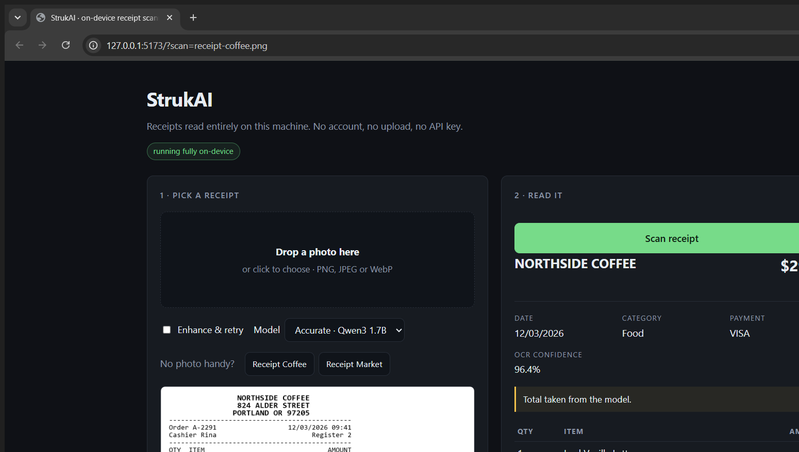

# StrukAI

Point a camera at a paper receipt, get a structured expense record. Everything
runs on your own machine: the OCR, the document classifier, the language model
and the upscaler all execute locally through the [QVAC SDK](https://qvac.tether.io).
No account, no API key, and the image never leaves the device.



## Why

The usual answer to "scan my receipts" is to upload them somewhere. That means a
receipt, which usually carries a merchant name, a timestamp, a card fragment and
sometimes a loyalty number, gets handed to a third party. StrukAI takes the other
trade: a local model that is good enough to be useful and honest about the parts
it is not sure about.

Two ideas do most of the work:

- **The model is asked for JSON, and the grammar enforces it.** The receipt schema
  is compiled to GBNF and applied by llama.cpp during generation, so the output is
  structurally valid by construction rather than by hoping and repairing.
- **The printed total wins.** OCR and the model both make mistakes, so the total
  is independently recovered from the raw text by matching the `TOTAL` line. When
  the two disagree the receipt says so in the UI instead of quietly picking one.

## Quick start

Requires **Node.js 20+** and about **2 GB of free disk** for the models. The
first run downloads weights; after that everything is cached in `~/.qvac`.

```bash
npm install
npm start
```

Then open <http://127.0.0.1:5173> and drop in a receipt, or click one of the
bundled samples. The server binds to loopback on purpose, so nothing on your
network can reach it.

To watch it drive itself, which is also how the screenshot above was captured:

```
http://127.0.0.1:5173/?scan=receipt-coffee.png
```

## How a scan works

| Step | QVAC function | Model | Why |
| --- | --- | --- | --- |
| Read the text | `ocr` | `OCR_LATIN` | Recognises the printed lines and reports a per-word confidence |
| Find the totals | &mdash; | &mdash; | Regex over the raw text, independent of the model |
| Classify the document | `classify` | bundled classifier | A second opinion on what kind of paper this is |
| Read the expense | `completion` | `QWEN3_1_7B_INST_Q4` | Turns the text into a typed record under a JSON grammar |
| Optionally enlarge | `upscale` | `REALESRGAN_X4PLUS` | Only offered when the first OCR pass came out shaky |

The upscale step is off by default and is genuinely slow: on the machine this was
built on, enlarging a 1252x802 receipt took about six and a half minutes. Ticking
"Enhance & retry" is a decision, not a default.

The expensive work happens last so it can be skipped. OCR is what tells us whether
the image was legible at all, and its confidence score is the only thing that
decides whether enlarging is worth the wait.

### Models

| Quality | Model | Size | Speed | Notes |
| --- | --- | --- | --- | --- |
| Accurate (default) | `QWEN3_1_7B_INST_Q4` | 1.06 GB | ~12 tok/s | Reads damaged receipts correctly |
| Fast | `QWEN3_600M_INST_Q4` | 382 MB | ~31 tok/s | Two to three times quicker, materially worse on hard images |

Both are pinned to a fixed seed and temperature 0, so the same image gives the
same record.

## Measured behaviour

On the two bundled samples, on an Intel Iris Xe laptop with no discrete GPU:

| | `receipt-coffee.png` | `receipt-market.png` |
| --- | --- | --- |
| OCR confidence | 96.4% | 69.5% |
| Total | 29.92 correct | 58.25 correct |
| Category | `food` | `groceries` |
| Subtotal / tax | 27.50 / 2.42 | read from the damaged lines |
| Wall clock | ~91 s | ~95 s |

The market sample is deliberately a bad photo, and the point of it is the second
row: the 0.6B model returned a total of `0` for it, while the 1.7B model and the
regex both found `58.25`. Accuracy is a reason the larger model is the default.

## Tests

```bash
npm test          # parser and OCR-reconstruction unit tests, no models needed
npm run selftest  # proves the device can load a model and generate
npm run probe     # all capabilities; or: ocr | classify | upscale | llm
npm run eval      # extraction quality of one model against the fixtures
node scripts/e2e.mjs   # full HTTP + event-stream run against a live server
```

`npm run probe` takes an image for the probes that need one, for example
`npm run probe -- ocr samples/receipt-coffee.png`, and prints the raw OCR blocks.

The unit tests run in about 200 ms and touch no models, so they are cheap enough
to run on every change. Several of them exist because they caught a real bug: the
total regex originally could not match a plain `TOTAL`, the day/month fallback
silently swapped ambiguous dates, and a blank line in the receipt was allowing a
phone number to be read as the total.

## API

```
GET  /api/health                  readiness and which models are resident
GET  /api/samples                 the bundled sample receipts
POST /api/scan?quality=&enhance=  raw image bytes in, { jobId } out
GET  /api/jobs/:id/events         server-sent progress and the result
POST /api/release                 free the models
```

`POST /api/scan` takes the raw encoded image as the request body rather than
`multipart/form-data`, which keeps the server free of a multipart parser. It
answers `202` immediately with a job id so the browser can watch progress instead
of guessing.

## Limitations

- Receipts must be in English. `OCR_LATIN` is configured with `langList: ['en']`.
- Single digits in a narrow column are the first thing OCR loses. Quantities are
  therefore the least reliable field on the record.
- A printed date like `12/03/2026` is genuinely ambiguous, so StrukAI reports
  `date_raw` and leaves `date` empty rather than coin-flipping a date into an
  expense log.
- Expect roughly 90 seconds for the first scan of a session, most of it OCR on
  CPU. Later scans in the same session skip the downloads.
- Currency is read from what is printed, so a stray `€` picked up from a damaged
  line can win over the amounts that clearly use a different symbol.

## Project layout

```
src/
  server.js      loopback HTTP server, SSE progress, static files
  pipeline.js    scan orchestration: OCR, classify, extract, optional upscale
  engine.js      model residency, so a 1 GB model is loaded at most once
  receipt.js     the schema, the prompt, and the deterministic parsing
  ocr-lines.js   rebuilds reading order and columns from per-word boxes
  public/        the UI, no CDN, no build step
samples/         two original receipts drawn by make-samples.ps1
scripts/         selftest, probe, eval, e2e, OCR fixture dump
test/            unit tests
```

`samples/*.png` are generated by `samples/make-samples.ps1` with System.Drawing
rather than being downloaded, so they are original, tiny, and regenerable on any
Windows machine.

## Credits

Built on the [QVAC SDK](https://qvac.tether.io) by Tether, which is what makes
running all of this on-device practical.

## License

MIT, see [LICENSE](LICENSE).
